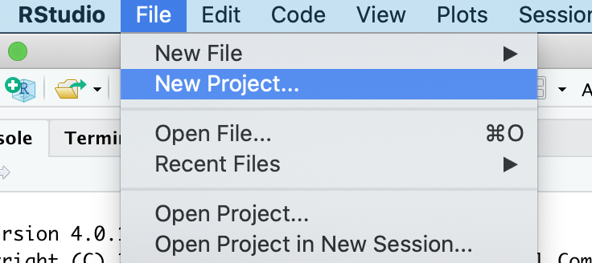
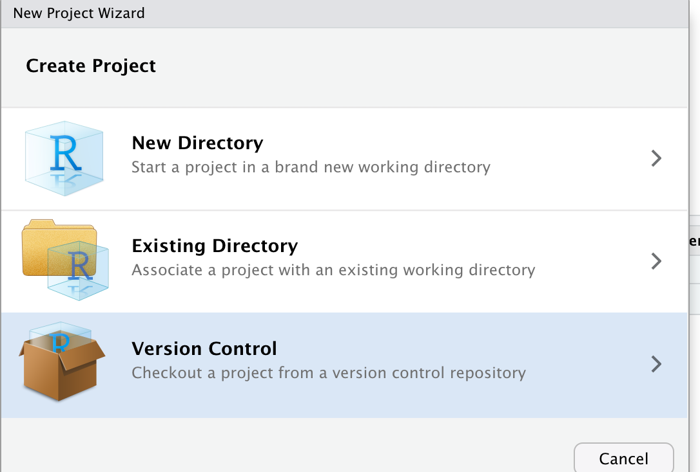
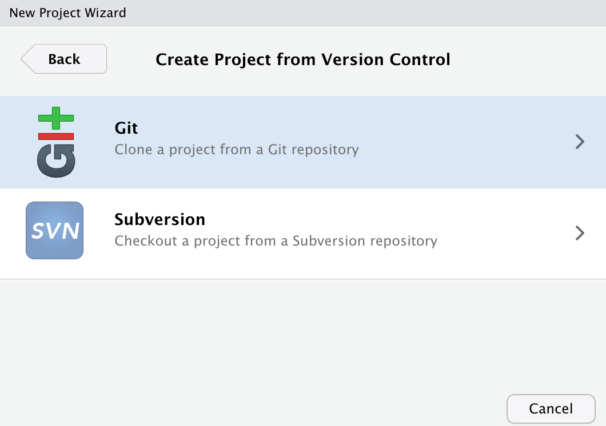
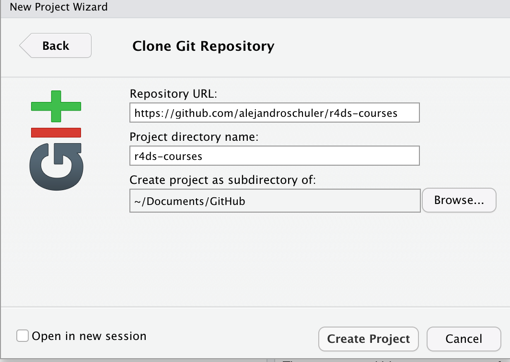
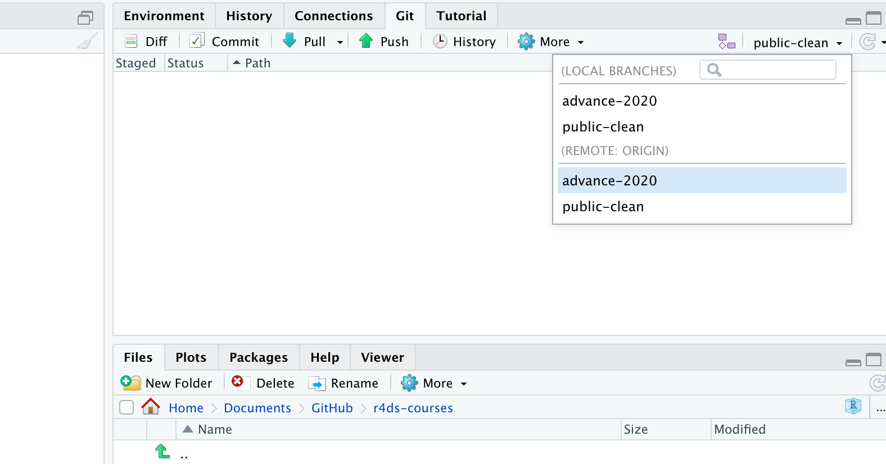

## Download and Install Git: `https://git-scm.com/downloads`

## Enable Git in RStudio

### 1. Start a new project in RStudio using the file menu

### 2. Select “version control”

### 3. Select “Git”

### 4. Use `github.com/alejandroschuler/r4ds-courses` as the URL. Name the directory whatever you want and create it as a subdirectory of whatever folder you want (e.g. Desktop, My Documents, etc.).

### 5. In the Git tab that appears (upper right pane by default) select `advance-2020` from the branch menu (the menu shows `public-clean` by default)

