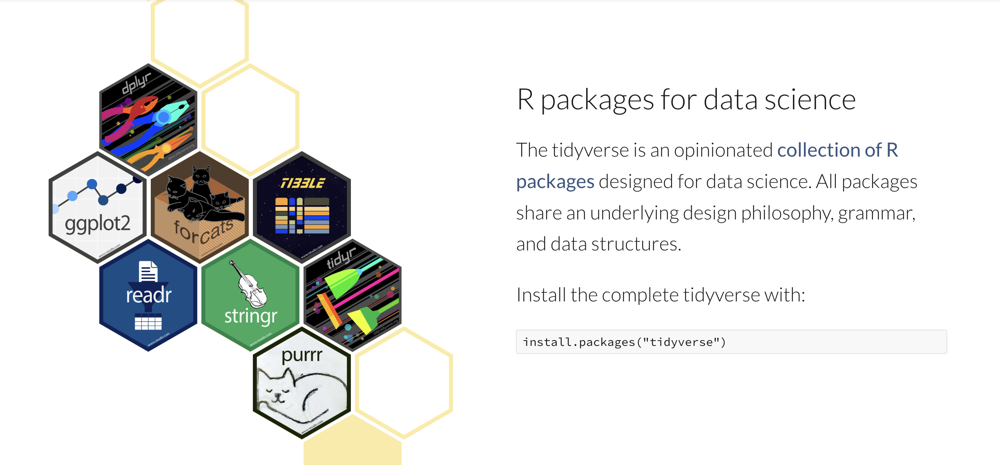
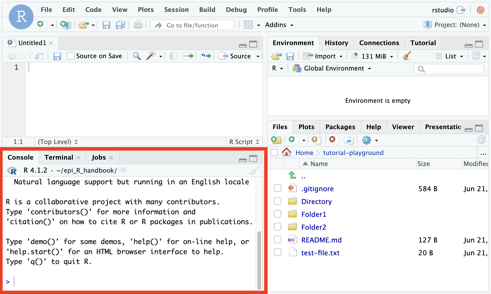

Tabular Data Foundations
========================================================
author: Alejandro Schuler and David Connell
date: 2022
transition: none
width: 1680
height: 1050

Adapted from [Steve Bagley](https://profiles.stanford.edu/steven-bagley) and based on [R for Data Science by Hadley Wickham](https://r4ds.had.co.nz/)


<style>
.small-code pre code {
  font-size: 0.5em;
}
</style>

Introduction to the course
========================================================
type: section


Goals of this course
========================================================
By the end of the course you should be able to...

- write neat R scripts and markdown reports in R studio
- find, read, and understand package and function documentation 
- read and write tabular data into R from CSV files
- manipulate and subset tabular data
- visualize tabular data using line and scatter plots

<div align="left">

</div>

Resources for this course
========================================================

## Tidyverse

- The tidyverse collection of R packages is used in this course, and in PHW142, to provide lots of additional functionality that's not present in the basic R programming language.

<div align="center">

</div>

Resources for this course
========================================================

<div align="right">

</div>

***
## [R for Data Science (R4DS) free online book by Hadley Wickham](https://r4ds.had.co.nz)

- Fundamentals: ch 1, 4, 6
- Input/output: ch 11
- Data manipulation: ch 5, 13
- Visualization: ch 3, 28

## [RStudio cheatsheets](https://www.rstudio.com/resources/cheatsheets/)

- Extremely useful reference guides for functions used in this course

RStudio
========================================================
type: section


The basics of interaction using the console window
========================================================

If you haven't already, please open RStudio on DataHub by [clicking this link](https://publichealth.datahub.berkeley.edu/hub/user-redirect/git-pull?repo=https%3A%2F%2Fgithub.com%2Fpre-142-training%2Ftutorial-playground&urlpath=rstudio%2F&branch=main). If you're viewing this on bCourses, you'll have to right click and then choose "Open Link in New Tab".

You will get more out of this tutorial if you try out these things in R yourself!!

The R console window is the left (or lower-left) window in RStudio.
The R console uses a "read, eval, print" loop. This is sometimes
called a REPL.
- Read: R reads what you type ...
- Eval: R evaluates it ...
- Print: R prints the result ...
- Loop: (repeat forever)

***

<div align="left">

</div>


A simple example in the console
========================================================
- The box contains an expression that will be evaluated by R, followed by the result of evaluating that expression.

```r
> 1 + 2
[1] 3
```
- `3` is the answer
- `[1]` means: the answer is a vector (a list of elements of the same type) and this line starts with the first element of that vector.
- It does not mean the answer has one element (although that is true in this case).


Spaces (mostly) don't matter
========================================================

```r
> 1 +2
> 1+ 2
> 1+2
> 1 + 2
```

These all do the same thing. The result of each line is `3`:


```
[1] 3
```

Basic calculations and vectors
========================================================
type: section

R is a scientific calculator
========================================================

```r
> 1 + 2 * 3
[1] 7
> log(10)
[1] 2.302585
> 4 * atan(1)
[1] 3.141593
> 6^3
[1] 216
```

Vectors
========================================================

```r
> c(2.1, -4, 22)
[1]  2.1 -4.0 22.0
```
- A vector is a one-dimensional sequence of zero or more numbers (or other values).
- Vectors are created by wrapping the values separated by commas with the `c(` `)` function, which is short for "combine"

```r
> 1:50
 [1]  1  2  3  4  5  6  7  8  9 10 11 12 13 14 15 16 17 18 19 20 21 22 23 24 25
[26] 26 27 28 29 30 31 32 33 34 35 36 37 38 39 40 41 42 43 44 45 46 47 48 49 50
```
- The colon `:` is a handy shortcut to create a vector that is
a sequence of integers from the first number to the second number
(inclusive).
- Many R functions and operators automatically work with
multi-element vector arguments.
- Long vectors wrap around. (Your screen may have a different width than what is shown here.)
- Look at the `[ ]` notation. The second output line starts
with 23, which is the 24^th element of the vector.
- This notation will help you figure out where you are in a long vector.

Elementwise operations on a vector
========================================================
  - This multiplies each element of `1:10` by the corresponding
element of `1:10`, that is, it squares each element.

```r
> (1:10)*(1:10)
 [1]   1   4   9  16  25  36  49  64  81 100
```
- Equivalently, we
could use exponentiation:

```r
> (1:10)^2
 [1]   1   4   9  16  25  36  49  64  81 100
```

Operator precedence: the rules
========================================================
- R does not evaluate strictly left to right. Instead,
operators have their own precedence, a kind of priority for
evaluation.
- The sequence operator : has a higher precedence than addition +.

```r
> 1 + 0:10
 [1]  1  2  3  4  5  6  7  8  9 10 11
> 0:10 + 1 # which operator gets executed first?
 [1]  1  2  3  4  5  6  7  8  9 10 11
> (0:10) + 1
 [1]  1  2  3  4  5  6  7  8  9 10 11
> 0:(10 + 1)
 [1]  0  1  2  3  4  5  6  7  8  9 10 11
```


Variables
========================================================
type: section

Saving values by setting a variable
========================================================

```r
> x <- 10
```
- To do more complex computations, we need to be able to give
names to things.
- Read this as "x gets 10" or "assign 10 to x"
- R prints no result from this assignment, but what you entered
causes a side effect: R has stored the association between
x and 10. (Look at the Environment pane.)


Using the value of a variable
========================================================

```r
> x
[1] 10
> x / 5
[1] 2
```
- When R sees the name of a variable, it uses the stored value of
that variable in the calculation.
- Here R uses the value of x, which is 10.
- `/` is the division operator.
- We can break complex calculations into named parts. This is a
simple, but very useful kind of abstraction.


Two ways to assign
========================================================
In R, there are (unfortunately) two assignment operators. They have
subtly different meanings (more details later).
- `<-` requires that you type two characters. Don't put a
space between `<` and `-`. (What would happen?)
- RStudio hint: Use "`Option -`" (Mac) or "`Alt -`" (PC)
to type this using one key combination.
- `=` is easier to type.
- You will see both used throughout R and user code.


```r
> x <- 10
> x
[1] 10
> x = 20
> x
[1] 20
```


Assignment has no undo
========================================================

```r
> x <- 10
> x
[1] 10
> x <- x + 1
> x
[1] 11
```
- If you assign to a name with an existing value, that value is overwritten.
- There is no way to undo an assignment, so be careful in reusing variable names.

Naming variables
========================================================
- It is important to pick meaningful variable names.
- Names can be too short, so don't use `x` and `y` everywhere.
- Names can be too long (`Main.database.first.object.header.length`).
- Avoid silly names.
- Pick names that will make sense to someone else (including the
person you will be in six months).
- ADVANCED: See `?make.names` for the complete rules on
what can be a name.


Case matters for names in R
========================================================

```r
> a <- 1
> A # this causes an error because A does not have a value
```
```
Error: object 'A' not found
```
- R cares about upper and lower case in names.
- We also see that some error messages in R are a bit obscure.


More about naming
========================================================
There are different conventions for constructing compound names. Warning:
disputes over the right way to do this can get heated.

```r
stringlength
string.length
StringLength
stringLength
string_length (underbar)
string-length (hyphen)
```
- To be consistent with the packages we will use, I recommend snake_case where you separate lowercase words with _
- Note that R itself uses several of these conventions.
- One of these won't work. Which one and why?
  
R saves some names for itself
========================================================

```r
> for <- 7 # this causes an error
```
- `for` is a reserved word in R. (It is used in loop control.)
- ADVANCED: see `?Reserved` for the complete rules.

Exercise: birth year
===
- Make a variable that represents the age you will be at the end of this year
- Make a variable that represents the current year
- Use them to compute the year of your birth and save that as a variable
- Print the value of that variable

Answer: birth year
===

```r
> my_age_end_of_year = 29
> this_year = 2019
> my_birth_year = this_year - my_age_end_of_year
> my_birth_year
[1] 1990
```

Functions
========================================================
type: section

Calling built-in functions
========================================================
- To call a function, type the function name, then the argument or
arguments in parentheses. (Use a comma to separate the arguments, if
                           more than one.)

```r
> sqrt(2)
[1] 1.414214
```
- Many basic R functions operate on multi-element vectors as
easily as on vectors containing a single number.

```r
> sqrt(0:10)
 [1] 0.000000 1.000000 1.414214 1.732051 2.000000 2.236068 2.449490 2.645751
 [9] 2.828427 3.000000 3.162278
```

Functions and variable assignment
========================================================

```r
> x <- 4
> sqrt(x)
[1] 2
> x
[1] 4
> y <- sqrt(x)
> y
[1] 2
> x <- 10
> y
[1] 2
```
- What do you observe?

Functions and variable assignment
========================================================
- functions generally do not affect the variables you pass to them (`x` remains the same after `sqrt(x)`)
- The results of a function call will simply be printed out if you do not save the result to a variable
- Saving the result to a variable lets you use it later, like any other variable you define manually
- Once a variable has been assigned (`y`), it keeps its value until updated, even if you change other variables (`x`) that went into the original assignment of that variable

Getting help in the RStudio console
========================================================

```r
> sum
```
- start typing, then hit `TAB` (or just wait a second)
- RStudio will display help on all functions that start `sum`.
- Use (up arrow, down arrow) to move through
the list.
- Use `RETURN` or `ENTER` to select the current
item.

Using the built-in help
========================================================
Type `?name` for help on name. Example:

```r
> ?log
```
- This will show information about the `log` function (and related functions), including the name and meaning of the arguments and returned values.
- The help display is hyperlinked, so clicking on a blue link will take you to related material.
- R documentation often describes a set of functions, such as all the ones related to logarithms, on a single help page.
- Parts of the R documentation are rather obscure.


Getting help on operator symbols
========================================================
  
  ```text
  > ?"+"
  ```
- This will show help about the `+` operator.
- Put symbols in quotes to get help.


Exercise: convert weights
========================================================

```r
> weights <- c(1.1, 2.2, 3.3)
```
- These weights are in pounds.
- Convert them to kilograms.
- (Hint: 2.2 lb = 1.0 kg)


Answer: convert weights
========================================================

```r
> weights <- c(1.1, 2.2, 3.3)
> ## this divides the weights, element-wise, by the conversion factor:
> weights / 2.2
[1] 0.5 1.0 1.5
```


Some functions operate on vectors and give back a single number
========================================================

```r
> shoesize <- c(9, 12, 6, 10, 10, 16, 8, 4)
> shoesize
[1]  9 12  6 10 10 16  8  4
> sum(shoesize)
[1] 75
> sum(shoesize)/length(shoesize)
[1] 9.375
> mean(shoesize)
[1] 9.375
```


Exercise: subtract the mean
========================================================

```r
> x <- c(7, 3, 1, 9)
```
- Subtract the mean of `x` from `x`, and then `sum`
the result.


Answer: subtract the mean
========================================================

```r
> x <- c(7, 3, 1, 9)
> mean(x)
[1] 5
> x - mean(x)
[1]  2 -2 -4  4
> sum(x - mean(x)) # answer in one expression
[1] 0
```


Exercise: compute a confidence interval
========================================================

```r
> m <- 13
> se <- 0.25
```
- Given the values of `m` (mean), and `se` (standard error), construct a vector containing the two values, $m \pm 2 \times se$.
- That is, add and subtract two times the standard error
value to/from the mean value.
- Your output should look like:

```
[1] 12.5 13.5
```


Answer: compute a confidence interval
========================================================

```r
> ## one way:
> c(m - 2*se, m + 2*se)
[1] 12.5 13.5
> ## another way:
> m + c(-2, 2)*se
[1] 12.5 13.5
```


Arguments by position
========================================================

```r
> 1:5
[1] 1 2 3 4 5
> seq(1,5)
[1] 1 2 3 4 5
```
- `seq` is the function equivalent of the colon operator.
- Arguments can be specified by position, with one supplied
argument for each name in the function parameter list, and in the
same order.


Arguments by name
========================================================

```r
> seq(from = 1, to = 5)
[1] 1 2 3 4 5
> seq(to = 5, from = 1)
[1] 1 2 3 4 5
```
- Sometimes, arguments can be supplied by name using the syntax,
variable `=` value.
- When using names, the order of the named arguments
does not matter.
- You can mix positional and named arguments (carefully).
- Do not use `<-` in place of `=` when specifying
named arguments.


Using the correct argument name
========================================================

```r
> seq(1, 5)
[1] 1 2 3 4 5
> seq(from = 1, to = 5)
[1] 1 2 3 4 5
> seq(begin = 1, end = 5)
Warning: In seq.default(begin = 1, end = 5) :
 extra arguments 'begin', 'end' will be disregarded
[1] 1
```
- You have to use the correct argument name.


How to find the names of a function's arguments
========================================================
  - How can you figure out the names of seq's arguments? It is
a built-in function.
- Answer: the arguments are listed in the R documentation of the
function.

```r
> ## Try this:
> ?seq
```

Packages
============================================================
- An R package is a collection of functions and variables.
- Each package has a name.
- By default, when R starts up, the base packages
(datasets, utils, grDevices, graphics, stats, methods) are loaded
into the workspace for you.
- When you _install_ a package, a copy is downloaded from a
CRAN server to a directory on your local machine, but not loaded
into the workspace.
- When you _load_ a package, the contents the package are
copied into the workspace.
- If you try to load a package that has not been installed, you
will get an error.
- These operations can be initiated from either the graphical user
interface or through the console.


Installing a package
============================================================
- When you install a package, R may prompt you to select a CRAN
mirror. This is the server that R will use when installing packages.
Pick one that is geographically close to you.
- In RStudio, select Packages, then Install Packages.
- Or:

```r
> install.packages("name_of_package")
```
Try this now:

```r
> install.packages("tidyverse")
```


Loading a package
============================================================
- Use the `library` function to load an installed package.
- Terminology alert: Note that `library` _loads_ a package,
not a library.
- Hint: Put the library call(s) at the top of every script file you write.

```r
> library("name_of_package")
```

Calling functions from a package
============================================================
- Sometimes packages introduce name conflicts, which is when the pacakge loads a function that is named the same thing as a function that's already in the environment
- Typically, the package being loaded will take precedence over what is already loaded.
- For instance:

```r
> ?filter # returns documentation for a function called filter in the stats package
> library(dplyr)
> ?filter # now returns documentation for a function called filter in the dplyr package!
```
- You can tell R which function you want by specifying the package name and then `::` before the function name

```r
> ?stats::filter
> ?dplyr::filter
```
- This also works when calling the function in your code

RStudio scripts
============================================================
type: section


Using the script pane
============================================================
- Writing a series of expressions in the console rapidly gets
messy and confusing.
- The console window gets reset when you restart RStudio.
- It is better (and easier) to write expressions and functions
in the script pane (upper left), building up your analysis.
- There, you can enter expressions, evaluate them, and save the
contents to a .R file for later use.
- Look at the RStudio ``Code'' menu for some useful keyboard
commands.


Script pane example
============================================================
- Create a script pane: File > New File > R Script
- Put your cursor in the script pane.
- Type: `factorial(1:10)`
- Then hit `Command-RETURN` (Mac), or `Ctrl-ENTER` (Windows).
- That line is copied to the console pane and evaluated.
- You can save the script to a file.
- Explore the RStudio Code menu for other commands.

Adding comments
========================================================

```r
> ## This is a comment
> 1 + 2 # add some numbers
[1] 3
```
- Use a `#` to start a comment.
- A comment extends to the end of the
line and is ignored by R.

Introduction to Data Manipulation
========================================================
type: section


Need to install the tidyverse set of packages
========================================================
- Do this:

```r
> install.packages("tidyverse")
```

```r
> library("tidyverse")
── Attaching packages ─────────────────────────────────────── tidyverse 1.3.1 ──
✓ tibble  3.1.5     ✓ dplyr   1.0.7
✓ tidyr   1.1.4     ✓ stringr 1.4.0
✓ readr   2.0.2     ✓ forcats 0.5.1
✓ purrr   0.3.4     
── Conflicts ────────────────────────────────────────── tidyverse_conflicts() ──
x dplyr::filter() masks stats::filter()
x dplyr::lag()    masks stats::lag()
```
- "tidyverse" is a coherent set of packages for operating a kind of data called the "data frame".
- It is not built-in, so you need to install it (once), then load it each time you restart R.
- Put `library("tidyverse")` at the top of every script file....


Data frame: a two-dimensional data structure
========================================================
A data frame is one of the most powerful features in R.
- This is a compound data structure that can contain different
types of data, similar to an Excel spreadsheet.
- Typically, each row in a data frame contains information about one
instance of some (real-world) object.
- Each column can be thought of as a variable, containing the values for the
corresponding instances.
- All the values in one column should be of the same type (a number, a category, text, etc.), but
different columns can be of different types.
- Each column is actually a vector, so a data frame is like a list of vectors

Data frame example
========================================================


```r
> mtc
# A tibble: 32 × 11
     mpg   cyl  disp    hp  drat    wt  qsec    vs    am  gear  carb
   <dbl> <dbl> <dbl> <dbl> <dbl> <dbl> <dbl> <dbl> <dbl> <dbl> <dbl>
 1  21       6  160    110  3.9   2.62  16.5     0     1     4     4
 2  21       6  160    110  3.9   2.88  17.0     0     1     4     4
 3  22.8     4  108     93  3.85  2.32  18.6     1     1     4     1
 4  21.4     6  258    110  3.08  3.22  19.4     1     0     3     1
 5  18.7     8  360    175  3.15  3.44  17.0     0     0     3     2
 6  18.1     6  225    105  2.76  3.46  20.2     1     0     3     1
 7  14.3     8  360    245  3.21  3.57  15.8     0     0     3     4
 8  24.4     4  147.    62  3.69  3.19  20       1     0     4     2
 9  22.8     4  141.    95  3.92  3.15  22.9     1     0     4     2
10  19.2     6  168.   123  3.92  3.44  18.3     1     0     4     4
# … with 22 more rows
```
- This data set contains data on 32 different cars.
- A `tibble` is a kind of data frame. This one has 32 rows and 11 columns.  We only see the first 10 rows because of limited slide/screen space.
- Across the top is the name of each column. The next row shows the type of data in the column. `<dbl>`, means double-precision floating point number, which is a computer science term for any number with a decimal point in it (e.g. `1.3333`, `3.14159`, `1.0`)

Data frame example
========================================================

```r
> mtc
# A tibble: 32 × 11
     mpg   cyl  disp    hp  drat    wt  qsec    vs    am  gear  carb
   <dbl> <dbl> <dbl> <dbl> <dbl> <dbl> <dbl> <dbl> <dbl> <dbl> <dbl>
 1  21       6  160    110  3.9   2.62  16.5     0     1     4     4
 2  21       6  160    110  3.9   2.88  17.0     0     1     4     4
 3  22.8     4  108     93  3.85  2.32  18.6     1     1     4     1
 4  21.4     6  258    110  3.08  3.22  19.4     1     0     3     1
 5  18.7     8  360    175  3.15  3.44  17.0     0     0     3     2
 6  18.1     6  225    105  2.76  3.46  20.2     1     0     3     1
 7  14.3     8  360    245  3.21  3.57  15.8     0     0     3     4
 8  24.4     4  147.    62  3.69  3.19  20       1     0     4     2
 9  22.8     4  141.    95  3.92  3.15  22.9     1     0     4     2
10  19.2     6  168.   123  3.92  3.44  18.3     1     0     4     4
# … with 22 more rows
```
- Typically, each row in a data frame describes an
instance of some (real-world) object. (Yes: one row for each model of car.)
- Each column contains the values of a variable for the
corresponding instance. (Yes: one column for each variable.)

Reading in flat files
========================================================

```r
> mtc = read_csv("https://tinyurl.com/mtcars-csv")
```
- `read_csv` (from the `readr` package, part of `tidyverse`) reads in data frames that are stored in `.csv` files (.csv = comma-separated values)
- these files may be online (accessed via URL), or local, in which case the syntax is `read_csv("path/to/file/mtcars.csv")`
- try `?read_csv` to learn a bit more
- `.csv`s can also be exported from databases and saved locally to be read into R, although later we will learn how to communicate directly with a database to pull data into `R`.

Making data frames
========================================================
- use `tibble()` to make your own data frames from scratch in R

```r
> my_data = tibble( # newlines don't do anything, just increase clarity
+   mrn = c(1, 2, 3, 4),
+   age = c(33, 48, 8, 29)
+ )
> my_data
# A tibble: 4 × 2
    mrn   age
  <dbl> <dbl>
1     1    33
2     2    48
3     3     8
4     4    29
```

Data frame properties
========================================================
- `dim()` gives the dimensions of the data frame. `ncol()` and `nrow()` give you the number of columns and the number of rows, respectively.

```r
> dim(my_data)
[1] 4 2
> ncol(my_data)
[1] 2
> nrow(my_data)
[1] 4
```

- `names()` gives you the names of the columns (a vector)

```r
> names(my_data)
[1] "mrn" "age"
```

Data frame properties
========================================================
- `glimpse()` shows you a lot of information, `head()` returns the first `n` rows

```r
> glimpse(my_data)
Rows: 4
Columns: 2
$ mrn <dbl> 1, 2, 3, 4
$ age <dbl> 33, 48, 8, 29
> head(my_data, n=2)
# A tibble: 2 × 2
    mrn   age
  <dbl> <dbl>
1     1    33
2     2    48
```

dplyr verbs
========================================================
The rest of this section shows the basic data frame functions ("verbs") in the `dplyr` package (part of `tidyverse`). Each operation takes a data frame and produces a new data frame.

- `filter()` picks out rows according to specified conditions
- `select()` picks out columns according to their names
- `arrange()` sorts the row by values in some column(s)
- `mutate()` creates new columns, often based on operations on other columns
- `summarize()` collapses many values in one or more columns down to one value per column

These can all be used in conjunction with `group_by()` which changes the scope of each function from operating on the entire dataset to operating on it group-by-group. These six functions provide the verbs for a language of data manipulation. 

All verbs work similarly:

1. The first argument is a data frame.
2. The subsequent arguments describe what to do with the data frame, using the variable names (without quotes).
3. The result is a new data frame.

Together these properties make it easy to chain together multiple simple steps to achieve a complex result. Let’s dive in and see how these verbs work.

filter() subsets the rows of a data frame
========================================================

```r
> filter(mtc, mpg >= 25)
# A tibble: 6 × 11
    mpg   cyl  disp    hp  drat    wt  qsec    vs    am  gear  carb
  <dbl> <dbl> <dbl> <dbl> <dbl> <dbl> <dbl> <dbl> <dbl> <dbl> <dbl>
1  32.4     4  78.7    66  4.08  2.2   19.5     1     1     4     1
2  30.4     4  75.7    52  4.93  1.62  18.5     1     1     4     2
3  33.9     4  71.1    65  4.22  1.84  19.9     1     1     4     1
4  27.3     4  79      66  4.08  1.94  18.9     1     1     4     1
5  26       4 120.     91  4.43  2.14  16.7     0     1     5     2
6  30.4     4  95.1   113  3.77  1.51  16.9     1     1     5     2
```
- This produces (and prints out) a new tibble, which contains all the rows where the mpg value in that row is greater than or equal to 25.
- There are only 6 rows in this data frame.
- There are still 11 columns.

Combining constraints in filter
========================================================

```r
> filter(mtc, mpg >= 25, qsec < 19)
# A tibble: 4 × 11
    mpg   cyl  disp    hp  drat    wt  qsec    vs    am  gear  carb
  <dbl> <dbl> <dbl> <dbl> <dbl> <dbl> <dbl> <dbl> <dbl> <dbl> <dbl>
1  30.4     4  75.7    52  4.93  1.62  18.5     1     1     4     2
2  27.3     4  79      66  4.08  1.94  18.9     1     1     4     1
3  26       4 120.     91  4.43  2.14  16.7     0     1     5     2
4  30.4     4  95.1   113  3.77  1.51  16.9     1     1     5     2
```
- This filters by the **conjunction** of the two constraints---both must be satisfied.
- Constraints appear as second (and third...) arguments, separated by commas.


Filtering out all rows
=========================================================

```r
> filter(mtc, mpg > 60)
# A tibble: 0 × 11
# … with 11 variables: mpg <dbl>, cyl <dbl>, disp <dbl>, hp <dbl>, drat <dbl>,
#   wt <dbl>, qsec <dbl>, vs <dbl>, am <dbl>, gear <dbl>, carb <dbl>
```
- If the constraint is too severe, then you will select **no** rows, and produce a zero row sized tibble.

Comparison operators
=========================================================
- `==` tests for equality (do not use `=`)
- `>` and `<` test for greater-than and less-than
- `>=` and `<=` are greater-than-or-equal and less-than-or-equal
- these can also be used directly on vectors outside of data frames

```r
> c(1,5,-22,4) > 0
[1]  TRUE  TRUE FALSE  TRUE
```

Logical conjunctions
=========================================================

```r
> filter(mtc, mpg > 30 | mpg < 20)
# A tibble: 22 × 11
     mpg   cyl  disp    hp  drat    wt  qsec    vs    am  gear  carb
   <dbl> <dbl> <dbl> <dbl> <dbl> <dbl> <dbl> <dbl> <dbl> <dbl> <dbl>
 1  18.7     8  360    175  3.15  3.44  17.0     0     0     3     2
 2  18.1     6  225    105  2.76  3.46  20.2     1     0     3     1
 3  14.3     8  360    245  3.21  3.57  15.8     0     0     3     4
 4  19.2     6  168.   123  3.92  3.44  18.3     1     0     4     4
 5  17.8     6  168.   123  3.92  3.44  18.9     1     0     4     4
 6  16.4     8  276.   180  3.07  4.07  17.4     0     0     3     3
 7  17.3     8  276.   180  3.07  3.73  17.6     0     0     3     3
 8  15.2     8  276.   180  3.07  3.78  18       0     0     3     3
 9  10.4     8  472    205  2.93  5.25  18.0     0     0     3     4
10  10.4     8  460    215  3     5.42  17.8     0     0     3     4
# … with 12 more rows
```
- `|` stands for OR, `&` is AND
- as we have seen, separating conditions by a comma is the same as using `&` inside `filter()`
- these can be made into complex logical conditions 

Logical conjunctions
=========================================================

```r
> filter(mtc, !(mpg > 30 | mpg < 20))
# A tibble: 10 × 11
     mpg   cyl  disp    hp  drat    wt  qsec    vs    am  gear  carb
   <dbl> <dbl> <dbl> <dbl> <dbl> <dbl> <dbl> <dbl> <dbl> <dbl> <dbl>
 1  21       6  160    110  3.9   2.62  16.5     0     1     4     4
 2  21       6  160    110  3.9   2.88  17.0     0     1     4     4
 3  22.8     4  108     93  3.85  2.32  18.6     1     1     4     1
 4  21.4     6  258    110  3.08  3.22  19.4     1     0     3     1
 5  24.4     4  147.    62  3.69  3.19  20       1     0     4     2
 6  22.8     4  141.    95  3.92  3.15  22.9     1     0     4     2
 7  21.5     4  120.    97  3.7   2.46  20.0     1     0     3     1
 8  27.3     4   79     66  4.08  1.94  18.9     1     1     4     1
 9  26       4  120.    91  4.43  2.14  16.7     0     1     5     2
10  21.4     4  121    109  4.11  2.78  18.6     1     1     4     2
```
- `!` is NOT, which negates the logical condition

Logical conjunctions
=========================================================

```r
> filter(mtc, cyl %in% c(6,8)) # equivalent to filter(mtc, cyl==6 | cyl==8)
# A tibble: 21 × 11
     mpg   cyl  disp    hp  drat    wt  qsec    vs    am  gear  carb
   <dbl> <dbl> <dbl> <dbl> <dbl> <dbl> <dbl> <dbl> <dbl> <dbl> <dbl>
 1  21       6  160    110  3.9   2.62  16.5     0     1     4     4
 2  21       6  160    110  3.9   2.88  17.0     0     1     4     4
 3  21.4     6  258    110  3.08  3.22  19.4     1     0     3     1
 4  18.7     8  360    175  3.15  3.44  17.0     0     0     3     2
 5  18.1     6  225    105  2.76  3.46  20.2     1     0     3     1
 6  14.3     8  360    245  3.21  3.57  15.8     0     0     3     4
 7  19.2     6  168.   123  3.92  3.44  18.3     1     0     4     4
 8  17.8     6  168.   123  3.92  3.44  18.9     1     0     4     4
 9  16.4     8  276.   180  3.07  4.07  17.4     0     0     3     3
10  17.3     8  276.   180  3.07  3.73  17.6     0     0     3     3
# … with 11 more rows
```
- `%in%` returns true for all elements of the thing on the left that are also elements of the thing on the right

Exercise: cars with powerful engines
==========================================================
- How many cars have engines with horsepower (`hp`) greater than 200?


Answer: cars with powerful engines
===========================================================

```r
> filter(mtc, hp > 200)
# A tibble: 7 × 11
    mpg   cyl  disp    hp  drat    wt  qsec    vs    am  gear  carb
  <dbl> <dbl> <dbl> <dbl> <dbl> <dbl> <dbl> <dbl> <dbl> <dbl> <dbl>
1  14.3     8   360   245  3.21  3.57  15.8     0     0     3     4
2  10.4     8   472   205  2.93  5.25  18.0     0     0     3     4
3  10.4     8   460   215  3     5.42  17.8     0     0     3     4
4  14.7     8   440   230  3.23  5.34  17.4     0     0     3     4
5  13.3     8   350   245  3.73  3.84  15.4     0     0     3     4
6  15.8     8   351   264  4.22  3.17  14.5     0     1     5     4
7  15       8   301   335  3.54  3.57  14.6     0     1     5     8
```
- Answer: 7


Exercise: filtering rows
========================================================
- List all cars with `mpg` between 15 and 20.


Answer: filtering rows
=========================================================

```r
> filter(mtc, mpg > 15, mpg < 20)
# A tibble: 12 × 11
     mpg   cyl  disp    hp  drat    wt  qsec    vs    am  gear  carb
   <dbl> <dbl> <dbl> <dbl> <dbl> <dbl> <dbl> <dbl> <dbl> <dbl> <dbl>
 1  18.7     8  360    175  3.15  3.44  17.0     0     0     3     2
 2  18.1     6  225    105  2.76  3.46  20.2     1     0     3     1
 3  19.2     6  168.   123  3.92  3.44  18.3     1     0     4     4
 4  17.8     6  168.   123  3.92  3.44  18.9     1     0     4     4
 5  16.4     8  276.   180  3.07  4.07  17.4     0     0     3     3
 6  17.3     8  276.   180  3.07  3.73  17.6     0     0     3     3
 7  15.2     8  276.   180  3.07  3.78  18       0     0     3     3
 8  15.5     8  318    150  2.76  3.52  16.9     0     0     3     2
 9  15.2     8  304    150  3.15  3.44  17.3     0     0     3     2
10  19.2     8  400    175  3.08  3.84  17.0     0     0     3     2
11  15.8     8  351    264  4.22  3.17  14.5     0     1     5     4
12  19.7     6  145    175  3.62  2.77  15.5     0     1     5     6
```


Filtering by row number
==========================================================

```r
> filter(mtc, row_number()<=3)
# A tibble: 3 × 11
    mpg   cyl  disp    hp  drat    wt  qsec    vs    am  gear  carb
  <dbl> <dbl> <dbl> <dbl> <dbl> <dbl> <dbl> <dbl> <dbl> <dbl> <dbl>
1  21       6   160   110  3.9   2.62  16.5     0     1     4     4
2  21       6   160   110  3.9   2.88  17.0     0     1     4     4
3  22.8     4   108    93  3.85  2.32  18.6     1     1     4     1
```
- use `row_number()` to get specific rows. This is more useful once you have sorted the data in a particular order, which we will soon see how to do.

Sampling rows
==========================================================

```r
> sample_n(mtc, 5)
# A tibble: 5 × 11
    mpg   cyl  disp    hp  drat    wt  qsec    vs    am  gear  carb
  <dbl> <dbl> <dbl> <dbl> <dbl> <dbl> <dbl> <dbl> <dbl> <dbl> <dbl>
1  10.4     8  460    215  3     5.42  17.8     0     0     3     4
2  16.4     8  276.   180  3.07  4.07  17.4     0     0     3     3
3  22.8     4  141.    95  3.92  3.15  22.9     1     0     4     2
4  19.2     8  400    175  3.08  3.84  17.0     0     0     3     2
5  15.5     8  318    150  2.76  3.52  16.9     0     0     3     2
```
- You can use `sample_n()` to get `n` randomly selected rows if you don't have a particular condition you would like to filter on.
- `sample_frac()` is similar
- do `?sample_n()` to see how you can sample with replacement or with weights

select() subsets columns by name
=========================================================

```r
> select(mtc, mpg, qsec, wt)
# A tibble: 32 × 3
     mpg  qsec    wt
   <dbl> <dbl> <dbl>
 1  21    16.5  2.62
 2  21    17.0  2.88
 3  22.8  18.6  2.32
 4  21.4  19.4  3.22
 5  18.7  17.0  3.44
 6  18.1  20.2  3.46
 7  14.3  15.8  3.57
 8  24.4  20    3.19
 9  22.8  22.9  3.15
10  19.2  18.3  3.44
# … with 22 more rows
```
- The select function will return a subset of the tibble, using only the requested columns in the order specified.

select() subsets columns by name
=========================================================
- `select()` can also be used with handy helpers like `starts_with()` and `contains()`

```r
> select(mtc, starts_with("m"))
# A tibble: 32 × 1
     mpg
   <dbl>
 1  21  
 2  21  
 3  22.8
 4  21.4
 5  18.7
 6  18.1
 7  14.3
 8  24.4
 9  22.8
10  19.2
# … with 22 more rows
```

select() subsets columns by name
=========================================================
- `select()` can also be used with handy helpers like `starts_with()` and `contains()`

```r
> select(mtc, hp, contains("m"))
# A tibble: 32 × 3
      hp   mpg    am
   <dbl> <dbl> <dbl>
 1   110  21       1
 2   110  21       1
 3    93  22.8     1
 4   110  21.4     0
 5   175  18.7     0
 6   105  18.1     0
 7   245  14.3     0
 8    62  24.4     0
 9    95  22.8     0
10   123  19.2     0
# … with 22 more rows
```
- The quotes around the letter `"m"` make it a character string (or string for short). If we did not do this, `R` would think it was looking for a variable called `m` and not just the plain letter. 
- We don't have to quote the names of columns (like `hp`) because the `tidyverse` functions know that we are working within the dataframe and thus treat the column names like they are variables in their own right

select() subsets columns by name
=========================================================
- `select()` can also be used to select everything **except for** certain columns

```r
> select(mtc, -contains("m"), -hp)
# A tibble: 32 × 8
     cyl  disp  drat    wt  qsec    vs  gear  carb
   <dbl> <dbl> <dbl> <dbl> <dbl> <dbl> <dbl> <dbl>
 1     6  160   3.9   2.62  16.5     0     4     4
 2     6  160   3.9   2.88  17.0     0     4     4
 3     4  108   3.85  2.32  18.6     1     4     1
 4     6  258   3.08  3.22  19.4     1     3     1
 5     8  360   3.15  3.44  17.0     0     3     2
 6     6  225   2.76  3.46  20.2     1     3     1
 7     8  360   3.21  3.57  15.8     0     3     4
 8     4  147.  3.69  3.19  20       1     4     2
 9     4  141.  3.92  3.15  22.9     1     4     2
10     6  168.  3.92  3.44  18.3     1     4     4
# … with 22 more rows
```

pull() is a friend of select()
=========================================================
- `select()` has a friend called `pull()` which returns a vector instead of a (one-column) data frame

```r
> select(mtc, hp)
# A tibble: 32 × 1
      hp
   <dbl>
 1   110
 2   110
 3    93
 4   110
 5   175
 6   105
 7   245
 8    62
 9    95
10   123
# … with 22 more rows
> pull(mtc, hp)
 [1] 110 110  93 110 175 105 245  62  95 123 123 180 180 180 205 215 230  66  52
[20]  65  97 150 150 245 175  66  91 113 264 175 335 109
```

Saving the result
=========================================================

```r
> filter(mtc, row_number()==1)
# A tibble: 1 × 11
    mpg   cyl  disp    hp  drat    wt  qsec    vs    am  gear  carb
  <dbl> <dbl> <dbl> <dbl> <dbl> <dbl> <dbl> <dbl> <dbl> <dbl> <dbl>
1    21     6   160   110   3.9  2.62  16.5     0     1     4     4
> head(mtc)
# A tibble: 6 × 11
    mpg   cyl  disp    hp  drat    wt  qsec    vs    am  gear  carb
  <dbl> <dbl> <dbl> <dbl> <dbl> <dbl> <dbl> <dbl> <dbl> <dbl> <dbl>
1  21       6   160   110  3.9   2.62  16.5     0     1     4     4
2  21       6   160   110  3.9   2.88  17.0     0     1     4     4
3  22.8     4   108    93  3.85  2.32  18.6     1     1     4     1
4  21.4     6   258   110  3.08  3.22  19.4     1     0     3     1
5  18.7     8   360   175  3.15  3.44  17.0     0     0     3     2
6  18.1     6   225   105  2.76  3.46  20.2     1     0     3     1
```
- `select()` and `filter()` are functions, so they do not modify their input. You can see `mtc` is unchanged after calling `filter()` on it. This holds for functions in general.

Saving the result
=========================================================
- To save a new version of mtc, use a variable

```r
> mtc_first_row = filter(mtc, row_number()==1)
> mtc_first_row
# A tibble: 1 × 11
    mpg   cyl  disp    hp  drat    wt  qsec    vs    am  gear  carb
  <dbl> <dbl> <dbl> <dbl> <dbl> <dbl> <dbl> <dbl> <dbl> <dbl> <dbl>
1    21     6   160   110   3.9  2.62  16.5     0     1     4     4
```

Combining filtering and selecting
=========================================================
- If the result of the operation will only be used by one other function, you can nest the calls:

```r
> # tmp = select(mtc, mpg, qsec, wt)
> # filter(tmp, mpg >= 25)
> filter(select(mtc, mpg, qsec, wt), mpg >= 25)
# A tibble: 6 × 3
    mpg  qsec    wt
  <dbl> <dbl> <dbl>
1  32.4  19.5  2.2 
2  30.4  18.5  1.62
3  33.9  19.9  1.84
4  27.3  18.9  1.94
5  26    16.7  2.14
6  30.4  16.9  1.51
```


arrange() sorts rows
===========================================================
- `arrange` takes a data frame and a column, and sorts the rows by the values in that column (ascending order).

```r
> powerful <- filter(mtc, hp > 200)
> arrange(powerful, mpg)
# A tibble: 7 × 11
    mpg   cyl  disp    hp  drat    wt  qsec    vs    am  gear  carb
  <dbl> <dbl> <dbl> <dbl> <dbl> <dbl> <dbl> <dbl> <dbl> <dbl> <dbl>
1  10.4     8   472   205  2.93  5.25  18.0     0     0     3     4
2  10.4     8   460   215  3     5.42  17.8     0     0     3     4
3  13.3     8   350   245  3.73  3.84  15.4     0     0     3     4
4  14.3     8   360   245  3.21  3.57  15.8     0     0     3     4
5  14.7     8   440   230  3.23  5.34  17.4     0     0     3     4
6  15       8   301   335  3.54  3.57  14.6     0     1     5     8
7  15.8     8   351   264  4.22  3.17  14.5     0     1     5     4
```

Arrange can sort by more than one column
===========================================================
- This is useful if there is a tie in sorting by the first column.

```r
> arrange(powerful, gear, disp)
# A tibble: 7 × 11
    mpg   cyl  disp    hp  drat    wt  qsec    vs    am  gear  carb
  <dbl> <dbl> <dbl> <dbl> <dbl> <dbl> <dbl> <dbl> <dbl> <dbl> <dbl>
1  13.3     8   350   245  3.73  3.84  15.4     0     0     3     4
2  14.3     8   360   245  3.21  3.57  15.8     0     0     3     4
3  14.7     8   440   230  3.23  5.34  17.4     0     0     3     4
4  10.4     8   460   215  3     5.42  17.8     0     0     3     4
5  10.4     8   472   205  2.93  5.25  18.0     0     0     3     4
6  15       8   301   335  3.54  3.57  14.6     0     1     5     8
7  15.8     8   351   264  4.22  3.17  14.5     0     1     5     4
```


Use the desc function to sort by descending values
===========================================================

```r
> arrange(powerful, desc(mpg))
# A tibble: 7 × 11
    mpg   cyl  disp    hp  drat    wt  qsec    vs    am  gear  carb
  <dbl> <dbl> <dbl> <dbl> <dbl> <dbl> <dbl> <dbl> <dbl> <dbl> <dbl>
1  15.8     8   351   264  4.22  3.17  14.5     0     1     5     4
2  15       8   301   335  3.54  3.57  14.6     0     1     5     8
3  14.7     8   440   230  3.23  5.34  17.4     0     0     3     4
4  14.3     8   360   245  3.21  3.57  15.8     0     0     3     4
5  13.3     8   350   245  3.73  3.84  15.4     0     0     3     4
6  10.4     8   472   205  2.93  5.25  18.0     0     0     3     4
7  10.4     8   460   215  3     5.42  17.8     0     0     3     4
```

Exercise: top 5 mpg cars
===========================================================
Use `arrange()` and `filter()` to get the data for the 5 cars with the highest mpg.

Answer: top 5 mpg cars
================================================================

```r
> filter(arrange(mtc, desc(mpg)), row_number()<=5) # "nesting" the calls to filter and arrange
# A tibble: 5 × 11
    mpg   cyl  disp    hp  drat    wt  qsec    vs    am  gear  carb
  <dbl> <dbl> <dbl> <dbl> <dbl> <dbl> <dbl> <dbl> <dbl> <dbl> <dbl>
1  33.9     4  71.1    65  4.22  1.84  19.9     1     1     4     1
2  32.4     4  78.7    66  4.08  2.2   19.5     1     1     4     1
3  30.4     4  75.7    52  4.93  1.62  18.5     1     1     4     2
4  30.4     4  95.1   113  3.77  1.51  16.9     1     1     5     2
5  27.3     4  79      66  4.08  1.94  18.9     1     1     4     1
```
or

```r
> cars_by_mpg = arrange(mtc, desc(mpg)) # using a temporary variable
> filter(cars_by_mpg, row_number()<=5)
# A tibble: 5 × 11
    mpg   cyl  disp    hp  drat    wt  qsec    vs    am  gear  carb
  <dbl> <dbl> <dbl> <dbl> <dbl> <dbl> <dbl> <dbl> <dbl> <dbl> <dbl>
1  33.9     4  71.1    65  4.22  1.84  19.9     1     1     4     1
2  32.4     4  78.7    66  4.08  2.2   19.5     1     1     4     1
3  30.4     4  75.7    52  4.93  1.62  18.5     1     1     4     2
4  30.4     4  95.1   113  3.77  1.51  16.9     1     1     5     2
5  27.3     4  79      66  4.08  1.94  18.9     1     1     4     1
```

mutate() creates new columns
================================================================

```r
> mtc_vars_subset = select(mtc, mpg, hp)
> mutate(mtc_vars_subset, gpm = 1/mpg)
# A tibble: 32 × 3
     mpg    hp    gpm
   <dbl> <dbl>  <dbl>
 1  21     110 0.0476
 2  21     110 0.0476
 3  22.8    93 0.0439
 4  21.4   110 0.0467
 5  18.7   175 0.0535
 6  18.1   105 0.0552
 7  14.3   245 0.0699
 8  24.4    62 0.0410
 9  22.8    95 0.0439
10  19.2   123 0.0521
# … with 22 more rows
```
- This uses `mutate` to add a new column to which is the reciprocal of `mpg`.
- The thing on the left of the `=` is a new name that you make up which you would like the new column to be called
- The expresssion on the right of the `=` defines what will go into the new column
-mutate() can create multiple columns at the same time and use multiple columns to define a single new one

mutate() can create multiple new columns at once
================================================================

```r
> mutate(mtc_vars_subset, # the newlines make it more readable
+       gpm = 1/mpg,
+       mpg_hp_ratio = mpg/hp) 
# A tibble: 32 × 4
     mpg    hp    gpm mpg_hp_ratio
   <dbl> <dbl>  <dbl>        <dbl>
 1  21     110 0.0476       0.191 
 2  21     110 0.0476       0.191 
 3  22.8    93 0.0439       0.245 
 4  21.4   110 0.0467       0.195 
 5  18.7   175 0.0535       0.107 
 6  18.1   105 0.0552       0.172 
 7  14.3   245 0.0699       0.0584
 8  24.4    62 0.0410       0.394 
 9  22.8    95 0.0439       0.24  
10  19.2   123 0.0521       0.156 
# … with 22 more rows
```
- As before, the result of this function is only saved if you assign it to a variable. In this example, `mtc_vars_subset` is unchanged after the mutate.

mutate() for data type conversion
===
- Data is sometimes given to you in a form that makes it difficult to do operations on

```r
> df = tibble(number = c("1", "2", "3"))
> mutate(df, number_plus_1 = number + 1)
Error: Problem with `mutate()` column `number_plus_1`.
ℹ `number_plus_1 = number + 1`.
x non-numeric argument to binary operator
```

- `mutate()` is also useful for converting data types, in this case text to numbers

```r
> mutate(df, number = as.numeric(number)) 
# A tibble: 3 × 1
  number
   <dbl>
1      1
2      2
3      3
```
- if you save the result into a column that already exists, it will be overwritten

summarize() computes desired summaires across rows
================================================================

```r
> summarize(mtc, mpg_avg=mean(mpg))
# A tibble: 1 × 1
  mpg_avg
    <dbl>
1    20.1
```
- `summarize()` boils down the data frame according to the conditions it gets. In this case, it creates a data frame with a single column called `mpg_avg` that contains the mean of the `mpg` column
- Summaries can be very useful when you apply them to subgoups of the data, which we will soon see how to do.

summarize() computes desired summaires across rows
================================================================
- you can also pass in multiple conditions that operate on multiple columns at the same time

```r
> summarize(mtc, # newlines not necessary, again just increase clarity
+           mpg_avg = mean(mpg), 
+           mpg_2x_max = max(2*mpg), 
+           hp_mpg_ratio_min = min(hp/mpg))
# A tibble: 1 × 3
  mpg_avg mpg_2x_max hp_mpg_ratio_min
    <dbl>      <dbl>            <dbl>
1    20.1       67.8             1.71
```

dplyr verbs summary
========================================================

- `filter()` picks out rows according to specified conditions
- `select()` picks out columns according to their names
- `arrange()` sorts the row by values in some column(s)
- `mutate()` creates new columns, often based on operations on other columns
- `summarize()` collapses many values in one or more columns down to one value per column

All verbs work similarly:

1. The first argument is a data frame.
2. The subsequent arguments describe what to do with the data frame, using the variable names (without quotes).
3. The result is a new data frame.

Together these properties make it easy to chain together multiple simple steps to achieve a complex result.

Computing over groups
==================================================================
type: section


group_by() groups data according to some variable(s)
==================================================================
First, let's load in some new data.

```r
> data1 <- read_csv("http://stanford.edu/~sbagley2/bios205/data/data1.csv")
Error in open.connection(structure(4L, class = c("curl", "connection"), conn_id = <pointer: 0x26f>), : HTTP error 404.
> data1
Error in eval(expr, envir, enclos): object 'data1' not found
```
- `<chr>` is short for "character string", which means text data
- Let's compute the mean weight for each gender.
- There are two values of gender in this data, so there will be two groups.
- The following builds a new version of the data frame that saves the grouping information:

```r
> data1_by_gender <- group_by(data1, gender)
Error in group_by(data1, gender): object 'data1' not found
```
- We can now use the grouped data frame in further calculations.

group_by() groups data according to some variable(s)
==================================================================

```r
> data1_by_gender
Error in eval(expr, envir, enclos): object 'data1_by_gender' not found
```
- The grouped data looks exactly the same, but under the hood, `R` knows that this is really two sub-data-frames (one for each group) instead of one.

Grouped summary: computing the mean of each group
===================================================================

```r
> summarize(data1_by_gender, mean_weight = mean(weight))
Error in summarize(data1_by_gender, mean_weight = mean(weight)): object 'data1_by_gender' not found
```
- `summarize()` works the same as before, except now it returns two rows instead of one because there are two groups that were defined by `group_by(gender)`.
- The result also always contains colunmns corresponding to the unique values of the grouping variable

Grouping can also be applied across multiple variables
===================================================================
- This computes the mean weight and the mean age for each group:

```r
> data1_by_gender_and_shoesize = group_by(data1, gender, shoesize)
Error in group_by(data1, gender, shoesize): object 'data1' not found
> summarize(data1_by_gender_and_shoesize, 
+           mean_weight = mean(weight), 
+           mean_age = mean(age))
Error in summarize(data1_by_gender_and_shoesize, mean_weight = mean(weight), : object 'data1_by_gender_and_shoesize' not found
```
- Now both `gender` and `shoesize` appear as columns in the result
- There are 3 rows because there are 3 unique combinations of `gender` and `shoesize` in the original data

Computing the number of rows in each group
=====================================================================
- The `n()` function counts the number of rows in each group:

```r
> summarize(data1_by_gender, count = n())
Error in summarize(data1_by_gender, count = n()): object 'data1_by_gender' not found
```


Computing the number of distinct values of a column in each group
=====================================================================
- The `n_distinct()` function counts the number of distinct (unique) values in the specified column:

```r
> summarize(data1_by_gender, n_sizes = n_distinct(shoesize))
Error in summarize(data1_by_gender, n_sizes = n_distinct(shoesize)): object 'data1_by_gender' not found
```
- Note: `distinct()` filters out any duplicate rows in a dataframe. The equivalent for vectors is `unique()`


Exercise: count states in each region
=====================================================================

```r
> state_data <- read_csv("http://stanford.edu/~sbagley2/bios205/data/state_data.csv")
Error in open.connection(structure(5L, class = c("curl", "connection"), conn_id = <pointer: 0x279>), : HTTP error 404.
> state_data
Error in eval(expr, envir, enclos): object 'state_data' not found
```
- How many states are in each region?


Answer: count states in each region
=====================================================================

```r
> state_data_by_region <- group_by(state_data, region)
Error in group_by(state_data, region): object 'state_data' not found
> summarize(state_data_by_region, n_states = n())
Error in summarize(state_data_by_region, n_states = n()): object 'state_data_by_region' not found
```


Challenge exercise: finding rows by group
===================================================================
`filter()` the grouped data in `data1_by_gender` to pick out the rows for the youngest male and female (hint: use `min()` and `==`).


Answer: finding rows by group
===================================================================

```r
> filter(data1_by_gender, age==min(age))
Error in filter(data1_by_gender, age == min(age)): object 'data1_by_gender' not found
```
- This shows how filter can be applied to grouped data. Instead of applying the condition across all the data, it applies it group-by-group.

Chaining: combining a sequence of function calls
=================================================================
type: section

Both nesting and temporary variables can be ugly and hard to read
=================================================================
- In this expression, the result of `summarize` is used as an argument to `arrange`.
- The operations are performed "inside out": first `summarize`, then `arrange`.

```r
> arrange(summarize(group_by(state_data, region), sd_area = sd(area)), sd_area)
```
- We could store the first result in a temporary variable:

```r
> state_data_by_region <- group_by(state_data, region)
Error in group_by(state_data, region): object 'state_data' not found
> region_area_sds <- summarize(state_data_by_region, sd_area = sd(area))
Error in summarize(state_data_by_region, sd_area = sd(area)): object 'state_data_by_region' not found
> arrange(region_area_sds, sd_area)
Error in arrange(region_area_sds, sd_area): object 'region_area_sds' not found
```


Chaining using the pipe operator
=================================================================
- Or, we can use a new operator, `%>%`, to "pipe" the result from the first
function call to the second function call.

```r
> state_data %>%
+   group_by(region) %>%
+   summarize(sd_area = sd(area)) %>%
+   arrange(sd_area)
Error in group_by(., region): object 'state_data' not found
```

- This makes explicit the flow of data through operations:
  - Start with `state_data`
  - group it by region
  - summarize by region, computing `sd_area`
  - arrange rows by `sd_area`
- The code reads like instructions that a human could understand
- putting the function calls on different lines also improves readability

Pipe: details
=================================================================

```r
> df1 %>% fun(x)
```
is converted into:

```r
> fun(df1, x)
```
- That is: the thing being piped in is used as the _first_ argument of `fun`.
- The tidyverse functions are consistently designed so that the first argument is a data frame, and the result is a data frame, so piping always works as intended.

Pipe: details
=================================================================
- However, the pipe works for all variables and functions, not just tidyverse functions

```r
> c(1,44,21,0,-4) %>%
+     sum()
[1] 62
> sum(c(1,44,21,0,-4))
[1] 62
> 1 %>% `+`(1) # `+` is just a function that takes two arguments!
[1] 2
```

Piping to another position
=== 
- The pipe typically pipes into the first argument of a function, but you can use the `.` syntax to send the argument elsewhere:

```r
> values = c(1,2,3,NA)
> 
> TRUE %>%
+   mean(values, na.rm=.)
[1] 2
```
- This is typically not done, but can be a handy shortcut in many situations

dplyr cheatsheet
============================================================
<div align="center">

</div>

Visualization basics
============================================================
type: section

ggplot2
=============================================================
- `ggplot2` is a very powerful graphics package.
- gg stands for "grammar of graphics"
- It was installed and loaded as part of `tidyverse`.
- Otherwise, you must do the following:

```r
> install.packages("ggplot2")
> library("ggplot2")
```


A simple scatterplot
=============================================================

```r
> ggplot(data = mtc, mapping = aes(x = hp, y = mpg)) + 
+   geom_point()
```


- Note that, although the package is named `ggplot2`, the function is called simply `ggplot()`

How to call ggplot
==============================================================

```r
ggplot(data = mtc, mapping = aes(x = hp, y = mpg)) + geom_point()
```
- `data = mtc`: this tells which tibble contains the data to be plotted
- `mapping = aes(x = hp, y = mpg)`: use the data in the hp column on x-axis, mpg column on y-axis
- `geom_point()`: plot the data as points
- Note that you can use positional instead of named arguments to make this expression shorter:

```r
ggplot(mtc, aes(hp, mpg)) + 
  geom_point()
```
- The use of "+" to glue these operations together will be explained later.


Change points to lines
===============================================================

```r
> ggplot(mtc, aes(hp, mpg)) + 
+   geom_line()
```


- This is pretty ugly. Line plots are better for time series.


Fit straight line to points
===============================================================

```r
> ggplot(mtc, aes(hp, mpg)) + 
+   geom_point() + 
+   geom_smooth(method="lm")
`geom_smooth()` using formula 'y ~ x'
```


- `"lm"` means "linear model," which is a least-squares regression line.
- The gray band is the confidence interval.


Fit smooth line to points
================================================================

```r
> ggplot(mtc, aes(hp, mpg)) + 
+   geom_point() + 
+   geom_smooth(method="loess")
`geom_smooth()` using formula 'y ~ x'
```


- "loess" fits a collection of tiny regression lines, then glues them together.
- This is a better approximation than a straight line for these data.


Fit smooth line to points without standard error
================================================================

```r
> mtc %>% # with the pipe
+ ggplot(aes(hp, mpg)) + 
+   geom_point() + 
+   geom_smooth(method="loess", se=FALSE)
`geom_smooth()` using formula 'y ~ x'
```


- `se = FALSE` means do not plot the confidence band (using the standard error)

Plotting categorical variables
====================================================================
- `gender` is a discrete variable, with two values.

```r
> data1 %>%
+   group_by(gender) %>%
+   summarize(mean_age=mean(age), mean_weight=mean(weight)) %>%
+ ggplot(aes(gender, mean_weight)) + 
+   geom_col()
Error in group_by(., gender): object 'data1' not found
```
- `geom_col()` is used to make a bar plot. Height of bar is the value for that group.

The grammar of graphics
============================================================
- Most graphics systems are a large collection of functions to call to
construct a graph piece by piece.
- `ggplot2` is different, and is based on the idea of a "grammar of
graphics," a set of primitives and rules for combining them in a way
that makes sense for plotting data.
- This perspective is quite powerful, but requires learning a bit of
vocabulary and a new way of thinking about graphics.


The ggplot2 model (simplified version)
============================================================
1. supply data frame (rows of observations, columns of variables)
2. use `aes` to map from variables (columns in data frame) to
aethetics (visual properties of the plot): x, y, color, size,
shape, and others.
3. choose a `geom`. This determines the type of the plot: point (a
scatterplot), line (line graph or line chart), bar (barplot), and
others.
4. choose a `stat` (statistical transformation): often `identity` (do
no transformation), but can be used to count, bin, or summarize
data (e.g., in a histogram).
5. choose a `scale`. This converts from the units used in the data
frame to the units used for display.
6. provide optional facet specification.

ggplot2 cheatsheet
============================================================
<div align="center">

</div>

Putting it together
=================================================================
type: section

Exercise: Is there a linear relationship between hp and 1/mpg?
=================================================================
- Use `ggplot` to look for a linear relationship between `hp` and `1/mpg` in our `mtc` data


Answer: Is there a linear relationship between hp and 1/mpg?
=================================================================

```r
> ggplot(mtc, aes(hp, 1/mpg)) + 
+   geom_point() + 
+   geom_smooth(method="lm", se=FALSE)
`geom_smooth()` using formula 'y ~ x'
```


- So, probably "yes"

Answer: Is there a linear relationship between hp and 1/mpg?
=================================================================
- Could also have done:

```r
> mtc %>%
>   mutate(gpm = 1/mpg) %>%
> ggplot(aes(hp, gpm)) + 
>   geom_point() + 
>   geom_smooth(method="lm", se=FALSE)
```

Exercise: orange trees
=================================================================

```r
> orange <- as_tibble(Orange) # this data is pre-loaded into R
```
1. Pull out the data for tree 2 only
2. Plot circumference versus age for those data

Answer: orange trees
==================================================================

```r
> orange %>%
+   filter(Tree == 2) %>%
+ ggplot(aes(age, circumference)) + 
+   geom_point()
```


Exercise: more orange trees
============================================================
1. Pull out the data for tree 2 where `age > 1000`
2. Plot circumference versus age for those data

Answer: more orange trees
==================================================================

```r
> orange %>%
+   filter(Tree == 2, age > 1000) %>%
+ ggplot(aes(age, circumference)) + 
+   geom_point()
```


Exercise: even more orange trees
============================================================
- Add a new column called `circum_in` which is the circumference in inches, not in millimeters.


Answer: even more orange trees
=================================================================

```r
> mutate(orange, circum_in = circumference/(10 * 2.54))
# A tibble: 35 × 4
   Tree    age circumference circum_in
   <ord> <dbl>         <dbl>     <dbl>
 1 1       118            30      1.18
 2 1       484            58      2.28
 3 1       664            87      3.43
 4 1      1004           115      4.53
 5 1      1231           120      4.72
 6 1      1372           142      5.59
 7 1      1582           145      5.71
 8 2       118            33      1.30
 9 2       484            69      2.72
10 2       664           111      4.37
# … with 25 more rows
```


Exercise: compute mean area per region
=====================================================================
Use the `state_data` data frame for this exercise.
- What is the mean area for each region?
- Sort the result by decreasing area.


Answer: compute mean area per region
=====================================================================

```r
> state_data %>%
+   group_by(region) %>%
+   summarize(mean_area = mean(area)) %>%
+   arrange(desc(mean_area))
Error in group_by(., region): object 'state_data' not found
```


Exercise: Sort the regions by area range
=====================================================================
- Sort the regions by the difference between the areas of the largest and smallest state in each region.


Answer: Sort the regions by area range
=====================================================================

```r
> state_data %>%
+   group_by(region) %>%
+   summarize(area_range = max(area) - min(area)) %>%
+   arrange(area_range)
Error in group_by(., region): object 'state_data' not found
```


Adding new column with data by group
=====================================================================

```r
> state_data2 <- state_data %>%
+   group_by(region) %>%
+   mutate(region_mean = mean(area))
Error in group_by(., region): object 'state_data' not found
> state_data2
Error in eval(expr, envir, enclos): object 'state_data2' not found
```
- This computes the mean area for each region, and places those values in a new column.
- The `region_mean` column has 50 values, one for each state, depending on the region the state is in.


Exercise: closest to region mean
=====================================================================
- Which state is closest to the mean of its region?


Answer: closest to region mean
=====================================================================

```r
> state_data2 %>%
+     mutate(diff = abs(area-region_mean)) %>%
+     filter(diff == min(diff))
Error in mutate(., diff = abs(area - region_mean)): object 'state_data2' not found
```

- We should use `ungroup()` to undo the `group_by()` so that the `filter()` is applied across the whole data frame and not region-by-region


```r
> state_data2 %>%
+     mutate(diff = abs(area-region_mean)) %>%
+     ungroup() %>% 
+     filter(diff == min(diff))
Error in mutate(., diff = abs(area - region_mean)): object 'state_data2' not found
```
- Answer: Florida


Exercise: smallest state in each region
=====================================================================
- What is the smallest state in each region?


Answer: smallest state in each region
=====================================================================

```r
> state_data %>%
+     group_by(region) %>%
+     filter(area == min(area))
Error in group_by(., region): object 'state_data' not found
```


Relational data and joins
============================================================
type: section

```r
> # install.packages("nycflights13")
> library(nycflights13)
```


Relational data
=====================================================================
class: small-code


```r
> head(flights)
# A tibble: 6 × 19
   year month   day dep_time sched_dep_time dep_delay arr_time sched_arr_time
  <int> <int> <int>    <int>          <int>     <dbl>    <int>          <int>
1  2013     1     1      517            515         2      830            819
2  2013     1     1      533            529         4      850            830
3  2013     1     1      542            540         2      923            850
4  2013     1     1      544            545        -1     1004           1022
5  2013     1     1      554            600        -6      812            837
6  2013     1     1      554            558        -4      740            728
# … with 11 more variables: arr_delay <dbl>, carrier <chr>, flight <int>,
#   tailnum <chr>, origin <chr>, dest <chr>, air_time <dbl>, distance <dbl>,
#   hour <dbl>, minute <dbl>, time_hour <dttm>
```

```r
> head(airports)
# A tibble: 6 × 8
  faa   name                             lat   lon   alt    tz dst   tzone      
  <chr> <chr>                          <dbl> <dbl> <dbl> <dbl> <chr> <chr>      
1 04G   Lansdowne Airport               41.1 -80.6  1044    -5 A     America/Ne…
2 06A   Moton Field Municipal Airport   32.5 -85.7   264    -6 A     America/Ch…
3 06C   Schaumburg Regional             42.0 -88.1   801    -6 A     America/Ch…
4 06N   Randall Airport                 41.4 -74.4   523    -5 A     America/Ne…
5 09J   Jekyll Island Airport           31.1 -81.4    11    -5 A     America/Ne…
6 0A9   Elizabethton Municipal Airport  36.4 -82.2  1593    -5 A     America/Ne…
```

***


```r
> head(planes)
# A tibble: 6 × 9
  tailnum  year type           manufacturer   model  engines seats speed engine 
  <chr>   <int> <chr>          <chr>          <chr>    <int> <int> <int> <chr>  
1 N10156   2004 Fixed wing mu… EMBRAER        EMB-1…       2    55    NA Turbo-…
2 N102UW   1998 Fixed wing mu… AIRBUS INDUST… A320-…       2   182    NA Turbo-…
3 N103US   1999 Fixed wing mu… AIRBUS INDUST… A320-…       2   182    NA Turbo-…
4 N104UW   1999 Fixed wing mu… AIRBUS INDUST… A320-…       2   182    NA Turbo-…
5 N10575   2002 Fixed wing mu… EMBRAER        EMB-1…       2    55    NA Turbo-…
6 N105UW   1999 Fixed wing mu… AIRBUS INDUST… A320-…       2   182    NA Turbo-…
```

```r
> head(weather)
# A tibble: 6 × 15
  origin  year month   day  hour  temp  dewp humid wind_dir wind_speed wind_gust
  <chr>  <int> <int> <int> <int> <dbl> <dbl> <dbl>    <dbl>      <dbl>     <dbl>
1 EWR     2013     1     1     1  39.0  26.1  59.4      270      10.4         NA
2 EWR     2013     1     1     2  39.0  27.0  61.6      250       8.06        NA
3 EWR     2013     1     1     3  39.0  28.0  64.4      240      11.5         NA
4 EWR     2013     1     1     4  39.9  28.0  62.2      250      12.7         NA
5 EWR     2013     1     1     5  39.0  28.0  64.4      260      12.7         NA
6 EWR     2013     1     1     6  37.9  28.0  67.2      240      11.5         NA
# … with 4 more variables: precip <dbl>, pressure <dbl>, visib <dbl>,
#   time_hour <dttm>
```

Relational data
===

<div align="center">

</div>

- `flights` connects to `planes` via a single variable, `tailnum`.
- `flights` connects to `airlines` through the `carrier` variable.
- `flights` connects to `airports` in two ways: via the `origin` and `dest` variables.
- `flights` connects to `weather` via `origin` (the location), and `year`, `month`, `day` and `hour` (the time).

An example join
===
- Imagine we want to add the full airline name to some columns from `flights`

```r
> flights %>%
+   select(tailnum, origin, dest, carrier) %>%
+   inner_join(airlines, by="carrier")
# A tibble: 336,776 × 5
   tailnum origin dest  carrier name                    
   <chr>   <chr>  <chr> <chr>   <chr>                   
 1 N14228  EWR    IAH   UA      United Air Lines Inc.   
 2 N24211  LGA    IAH   UA      United Air Lines Inc.   
 3 N619AA  JFK    MIA   AA      American Airlines Inc.  
 4 N804JB  JFK    BQN   B6      JetBlue Airways         
 5 N668DN  LGA    ATL   DL      Delta Air Lines Inc.    
 6 N39463  EWR    ORD   UA      United Air Lines Inc.   
 7 N516JB  EWR    FLL   B6      JetBlue Airways         
 8 N829AS  LGA    IAD   EV      ExpressJet Airlines Inc.
 9 N593JB  JFK    MCO   B6      JetBlue Airways         
10 N3ALAA  LGA    ORD   AA      American Airlines Inc.  
# … with 336,766 more rows
```

Joins
===

```r
> x <- tibble(
+   key = c(1,2,3),
+   val_x = c("x1","x2","x3")
+ )
> y <- tibble(
+   key = c(1,2,4),
+   val_y = c("y1","y2","y3")
+ )
```

<div align="center">

</div>

***


```r
> inner_join(x, y, by="key")
# A tibble: 2 × 3
    key val_x val_y
  <dbl> <chr> <chr>
1     1 x1    y1   
2     2 x2    y2   
```
- An inner join matches pairs of observations when their keys are equal
- the column that is joined on is specified with the named argument `by="column"`

<div align="center">

</div>

Duplicate keys
===

```r
> x <- tibble(
+   key = c(1,2,2,3),
+   val_x = c("x1","x2","x3","x4")
+ )
> y <- tibble(
+   key = c(1,2,2,4),
+   val_y = c("y1","y2","y3","y4")
+ )
```

<div align="center">

</div>

***


```r
> inner_join(x, y, by="key")
# A tibble: 5 × 3
    key val_x val_y
  <dbl> <chr> <chr>
1     1 x1    y1   
2     2 x2    y2   
3     2 x2    y3   
4     2 x3    y2   
5     2 x3    y3   
```

When keys are duplicated, multiple rows can match multiple rows, so each possible combination is produced

Specifying the keys
===

```r
> inner_join(airports, flights, by="origin")
Error: Join columns must be present in data.
x Problem with `origin`.
```
- Why does this fail?

Specifying the keys
===
- When keys have different names in different dataframes, the syntax to join is:

```r
> inner_join(airports, flights, by=c("faa"="origin"))
# A tibble: 336,776 × 26
   faa   name      lat   lon   alt    tz dst   tzone   year month   day dep_time
   <chr> <chr>   <dbl> <dbl> <dbl> <dbl> <chr> <chr>  <int> <int> <int>    <int>
 1 EWR   Newark…  40.7 -74.2    18    -5 A     Ameri…  2013     1     1      517
 2 EWR   Newark…  40.7 -74.2    18    -5 A     Ameri…  2013     1     1      554
 3 EWR   Newark…  40.7 -74.2    18    -5 A     Ameri…  2013     1     1      555
 4 EWR   Newark…  40.7 -74.2    18    -5 A     Ameri…  2013     1     1      558
 5 EWR   Newark…  40.7 -74.2    18    -5 A     Ameri…  2013     1     1      559
 6 EWR   Newark…  40.7 -74.2    18    -5 A     Ameri…  2013     1     1      601
 7 EWR   Newark…  40.7 -74.2    18    -5 A     Ameri…  2013     1     1      606
 8 EWR   Newark…  40.7 -74.2    18    -5 A     Ameri…  2013     1     1      607
 9 EWR   Newark…  40.7 -74.2    18    -5 A     Ameri…  2013     1     1      608
10 EWR   Newark…  40.7 -74.2    18    -5 A     Ameri…  2013     1     1      615
# … with 336,766 more rows, and 14 more variables: sched_dep_time <int>,
#   dep_delay <dbl>, arr_time <int>, sched_arr_time <int>, arr_delay <dbl>,
#   carrier <chr>, flight <int>, tailnum <chr>, dest <chr>, air_time <dbl>,
#   distance <dbl>, hour <dbl>, minute <dbl>, time_hour <dttm>
```

Exercise: finding planes
===
Use joins to find the models of airplane that fly into Seattle Tacoma Intl.

Answer: finding planes
===
Use joins to find the models of airplane that fly into Seattle Tacoma Intl.

```r
> airports %>%
+   filter(name=="Seattle Tacoma Intl") %>%
+   inner_join(flights, by=c("faa"="dest")) %>%
+   inner_join(planes, by="tailnum") %>%
+   select(model) %>%
+   distinct()
# A tibble: 24 × 1
   model    
   <chr>    
 1 737-890  
 2 737-832  
 3 737-924ER
 4 A320-232 
 5 737-824  
 6 757-231  
 7 757-232  
 8 757-2Q8  
 9 767-332  
10 757-222  
# … with 14 more rows
```

Other joins
===
- A left join keeps all observations in `x`.
- A right join keeps all observations in `y`.
- A full join keeps all observations in `x` and `y`.

<div align="center">

</div>

- Left join should be your default
  - it looks up additional information in other tables
  - preserves all rows in the table you're most interested in

***

<div align="center">

</div>

Joining on multiple columns
===
- It is often desirable to find matches along more than one column

```r
> flights %>%
+   select(tailnum, year:day, hour, origin) %>%
+   left_join(weather, by=c("year", "month", "day", "hour", "origin")) %>% 
+   head(3)
# A tibble: 3 × 16
  tailnum  year month   day  hour origin  temp  dewp humid wind_dir wind_speed
  <chr>   <int> <int> <int> <dbl> <chr>  <dbl> <dbl> <dbl>    <dbl>      <dbl>
1 N14228   2013     1     1     5 EWR     39.0  28.0  64.4      260       12.7
2 N24211   2013     1     1     5 LGA     39.9  25.0  54.8      250       15.0
3 N619AA   2013     1     1     5 JFK     39.0  27.0  61.6      260       15.0
# … with 5 more variables: wind_gust <dbl>, precip <dbl>, pressure <dbl>,
#   visib <dbl>, time_hour <dttm>
```
- This is also possible if the columns have different names

```r
> flights %>%
>   select(tailnum, year:day, hour, origin) %>%
>   rename(departure = origin) %>%
>   left_join(weather, by=c("year", "month", "day", "hour", "departure"="origin"))
```

Join problems
===
- Joins can be a source of subtle errors in your code
- check for `NA`s in variables you are going to join on
- make sure rows aren't being dropped if you don't intend to drop rows
  - checking the number of rows before and after the join is not sufficient. If you have an inner join with duplicate keys in both tables, you might get unlucky as the number of dropped rows might exactly equal the number of duplicated rows
- `anti_join()` and `semi_join()` are useful tools (filtering joins) to diagnose problems
  - `anti_join()` keeps only the rows in `x` that *don't* have a match in `y`
  - `semi_join()` keeps only the rows in `x` that *do* have a match in `y`

Exercise: nonexistent planes
====
It appears some of the `tailnum`s in `flights` do not appear in `planes`. Is there something those flights have in common that might help us diagnose the issue? 

Answer: nonexistent planes
====

```r
> bad_flight_carrier_count = flights %>% 
+   anti_join(planes, by="tailnum") %>%
+   sample_n(10)
```

Answer: nonexistent planes
====
It appears some of the `tailnum`s in `flights` do not appear in `planes`. Is there something those flights have in common that might help us diagnose the issue?

```r
> bad_flight_carrier_count = flights %>% 
+   anti_join(planes, by="tailnum") %>% 
+   count(carrier) %>% 
+   arrange(desc(n))
> bad_flight_carrier_count
# A tibble: 10 × 2
   carrier     n
   <chr>   <int>
 1 MQ      25397
 2 AA      22558
 3 UA       1693
 4 9E       1044
 5 B6        830
 6 US        699
 7 FL        187
 8 DL        110
 9 F9         50
10 WN         38
```

- `count(x)` is a shortcut for `group_by(x) %>% summarize(n=n())` 

***

Let's compare the counts of airlines with missing planes to the counts of airlines across all flight data

```r
> flight_carrier_count = flights %>% 
+   count(carrier) %>% 
+   arrange(desc(n))
> flight_carrier_count
# A tibble: 16 × 2
   carrier     n
   <chr>   <int>
 1 UA      58665
 2 B6      54635
 3 EV      54173
 4 DL      48110
 5 AA      32729
 6 MQ      26397
 7 US      20536
 8 9E      18460
 9 WN      12275
10 VX       5162
11 FL       3260
12 AS        714
13 F9        685
14 YV        601
15 HA        342
16 OO         32
```

Answer: nonexistent planes
====
We can already see the trend but let's clean it up a bit

```r
> flight_carrier_count %>%
>   left_join(bad_flight_carrier_count, 
>             by="carrier", 
>             suffix=c("_all", "_bad")) %>%
>   replace_na(list(n_bad=0)) %>% 
>   mutate(bad_ratio = n_bad/n_all) %>%
>   left_join(airlines, by="carrier") %>%
> ggplot(aes(y=name, x=bad_ratio)) + 
>   geom_point()
```

***


- Envoy Air and American Airlines are the culprits!

More about ggplot2
============================================================
type: section

Distinguishing groups in plots
========================================================

```r
> head(orange, 3)
# A tibble: 3 × 3
  Tree    age circumference
  <ord> <dbl>         <dbl>
1 1       118            30
2 1       484            58
3 1       664            87
```
- The data frame `orange` contains data on five trees.

Distinguishing groups in plots
========================================================

```r
> ggplot(orange, aes(age, circumference)) + 
+   geom_point()
```


- If we plot it, we see the data from all the trees in a single
plot, but would be better to visually distinguish the different trees

Example of ggplot2 with color
============================================================

```r
> ggplot(orange, aes(age, circumference)) + 
+   geom_point(aes(color = Tree))
```


Example of ggplot2 with color with larger dots
============================================================

```r
> ggplot(orange, aes(age, circumference)) + 
+   geom_point(aes(color = Tree), size=3)
```


- the aesthetics (what's inside of `aes()`) tell ggplot how the columns of the data relate to what should go on the plot
- things that don't relate to the data should go outisde of the call to `aes()`. e.g. `size=3` in this case.
- aesthetics defined in `ggplot()` are passed down to the geoms

Example of ggplot2 with plot shape
============================================================

```r
> ggplot(orange, aes(age, circumference)) + 
+   geom_point(aes(shape = Tree), size=3)
Warning: Using shapes for an ordinal variable is not advised
```


Example of ggplot2 with plot color and shape
============================================================

```r
> ggplot(orange, aes(age, circumference)) + 
+   geom_point(aes(color = Tree, shape = Tree), size=3)
Warning: Using shapes for an ordinal variable is not advised
```


Exercise: lines and colors
========================================================
Reproduce this plot


Answer: lines and colors
========================================================

```r
> ggplot(orange, aes(age, circumference)) +
+   geom_point(aes(color = Tree)) +
+   geom_line(aes(color = Tree))
```
or

```r
> orange %>%
+ ggplot(aes(age, circumference, color=Tree)) +
+   geom_point() +
+   geom_line()
```


- Recall that the aesthetics in `ggplot` are passed down to the geoms

Using the loess smoother
========================================================

```r
> ggplot(orange, aes(age, circumference)) +
+   geom_point() +
+   facet_wrap(~ Tree) +
+   geom_smooth(method = loess, se = FALSE)
`geom_smooth()` using formula 'y ~ x'
```


Exercise: loess with color
========================================================
Reproduce the following plot:


```
`geom_smooth()` using formula 'y ~ x'
```


Answer: loess with color
========================================================

```r
> ggplot(orange, aes(age, circumference, color=Tree)) +
+   geom_point() +
+   geom_smooth(method = loess, se = FALSE)
`geom_smooth()` using formula 'y ~ x'
```


Aesthetics can be used within each plot element separately
========================================================

```r
> ggplot(orange, aes(age, circumference)) +
+   geom_point(aes(shape=Tree)) +
+   geom_smooth(aes(color=Tree), method = loess, se = FALSE)
Warning: Using shapes for an ordinal variable is not advised
`geom_smooth()` using formula 'y ~ x'
```


Facets: multiple aligned plots by group
============================================================

```r
> ggplot(orange, aes(age, circumference)) + 
+   geom_point(size = 3) + 
+   facet_wrap(~ Tree)
```


Alternative using facets
========================================================

```r
> orange %>%
+ ggplot(aes(age, circumference)) + 
+   geom_point() + 
+   geom_line() +
+   facet_wrap(~ Tree)
```


Facet syntax
========================================================
- `facet_wrap(~ facet_variable)`: This puts the
facets left-to-right, top-to-bottom, wrapping around.
- `facet_grid(y-variable ~ .)`: This puts them in
a vertically-aligned stack, by value of the y-variable.
- `facet_grid(. ~ x-variable)`: This puts them in
a horizontally-aligned stack, by value of the x-variable.


Facet grid example 1
========================================================

```r
> ggplot(orange, aes(age, circumference)) +  
+   geom_point() +
+   facet_grid(. ~ Tree)
```


Facet grid example 2
========================================================

```r
> ggplot(orange, aes(age, circumference)) + 
+   geom_point() +
+   facet_grid(Tree ~ .)
```


Fitting straight lines
========================================================
- The data in each facet show a nearly linear relation between
circumference and age.
- R can calculate the least squares fit line and plot it atop
the data points.


Facet example with fitted lines (linear regression)
========================================================

```r
> ggplot(orange, aes(age, circumference)) +
+   geom_point() +
+   facet_wrap(~ Tree) +
+   geom_smooth(method = lm, se=FALSE)
`geom_smooth()` using formula 'y ~ x'
```


Error bars
============================================================
- Let's add error bars to a plot. We'll use the state data, which has
multiple area measurements for each of the four regions.

Error bars, first plot
=============================================================

```r
> ggplot(state_data, aes(region, area)) + 
+   geom_point()
Error in ggplot(state_data, aes(region, area)): object 'state_data' not found
```

Error bars, computing group mean and standard deviation
============================================================

```r
> plot = state_data %>%
+   group_by(region) %>%
+   summarize(
+     region_mean = mean(area),
+     region_sd = sd(area)) %>%
+ ggplot(aes(region, region_mean)) + 
+   geom_point()
Error in group_by(., region): object 'state_data' not found
> plot
function (x, y, ...) 
UseMethod("plot")
<bytecode: 0x7f86dc5722c0>
<environment: namespace:base>
```

Error bars: plot the error bars
============================================================

```r
> plot +
+   geom_errorbar(aes(ymin = region_mean - region_sd,
+                     ymax = region_mean + region_sd,
+                     width = 0.3))
NULL
```


ggplot2 and the + operator
========================================================
- `ggplot(...) + geom_point()` is a strange
expression: it uses the `+` operator to add things (plots and
plot specifications), which are not numbers.
- This uses a feature called generic functions: the types
of the arguments to `+` determine which piece of code, called a
method, to run.
- ggplot2 relies on this feature heavily.

```r
> p <- ggplot(mtc, aes(hp, mpg))
> l <- geom_point()
> p + l
```
- Note you can save parts of the graph specification and then add
them together.
- The graph will only be displayed when the third expression is
evaluated.

More on ggplot2
===
- Almost everything is customizable in ggplot. 
- See R for Data Science ch. 28 for more on changing legends, colors, axis labels, etc.
- There are thousands of examples online

<div align="left">

</div>


Reproducible analysis
============================================================
type: section


Reproducible analysis
========================================================

The goal of reproducible analysis is to produce a computational
artifact that others can view, scrutinize, test, and run, to convince
themselves that your ideas are valid. (It's also good for you to be as
skeptical of your work.) This means you should write code to be run
more than once and by others.

Doing so requires being organized in several ways:

- Combining text with code (the focus of this section)
- Project/directory organization
- Version control

The problem
========================================================
- You write text in a word processor.
- You write code to compute with data and produce output and
graphics.
- These are performed using different software.
- So when integrating both kinds of information into a notebook,
report, or publication, it is very easy to make mistakes,
copy/paste the wrong version, and have information out of sync.


A solution
========================================================
- Write text and code in the same file.
- Use special syntax to separate text from code.
- Use special syntax for annotating the text with formatting
operations (if desired).
- RStudio can then:
1. run the code blocks,
2. insert the output and graphs at the correct spot in the text,
3. then call a text processor for final formatting.
- This whole process is called "knitting".
- (live demo)
- jupyter notebooks (outside of RStudio) are an alternative for doing the same thing


R Markdown: The special syntax for formatting text
========================================================
- RStudio supports a simple and easy-to-use format called "R Markdown".
- This is a very simple markup language:
- use * or _ around italics.
- use ** or __ around bold.
- Markdown Quick Reference (RStudio internal help)
- [Introduction to R Markdown](http://shiny.rstudio.com/articles/rmarkdown.html)
- [R Markdown web page](http://rmarkdown.rstudio.com/)
- [R Markdown Cheat Sheet](http://shiny.rstudio.com/articles/rm-cheatsheet.html)


Wrap-up
========================================================
type: section

Goals of this course
========================================================
By the end of the course you should be able to...

- write neat R scripts and markdown reports in R studio
- find, read, and understand package and function documentation 
- read and write tabular data into R from flat files
- perform basic manipulations on tabular data: subsetting, manipulating and summarizing data, and joining
- visualize tabluar data using line and scatter plots along with color and facets

<div align="center">

</div>

Tidyverse
========================================================
<div align="center">

</div>

Resources for this course
========================================================

R for Data Science (R4DS): https://r4ds.had.co.nz
<div align="center">

</div>

***

- Fundamentals: ch 1, 4, 6
- Input/output: ch 11
- Data manipulation: ch 5, 13
- Visualization: ch 3, 28

Cheatsheets: https://www.rstudio.com/resources/cheatsheets/
